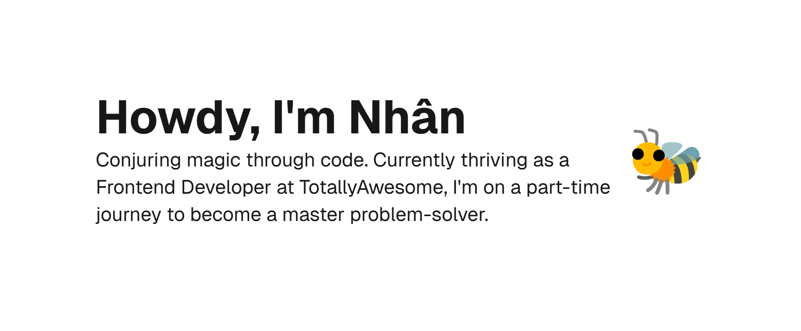

#  Lupin Portfolio

##  Features

##  Repository Information

This repository was forked from [dillionverma/portfolio](https://github.com/dillionverma/portfolio).

Feel free to explore and customize it to suit your needs!

##  License

Licensed under the [MIT license](https://github.com/dillionverma/portfolio/blob/main/LICENSE.md).
